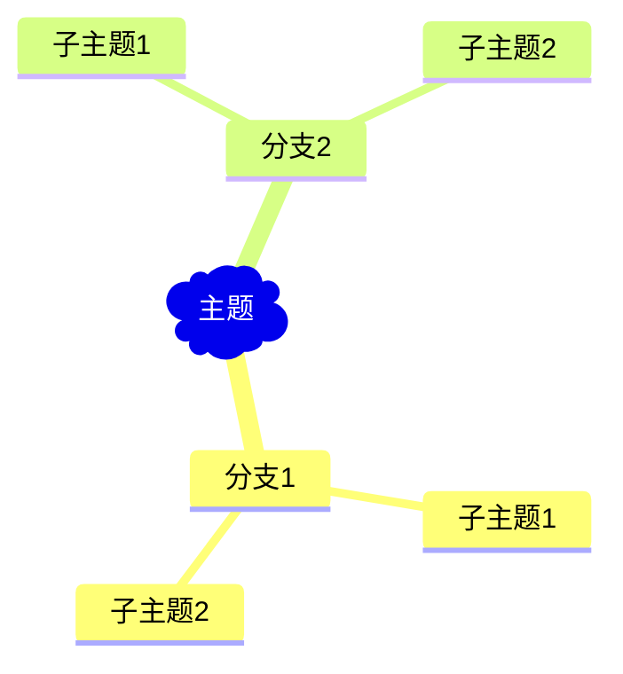

# AI思维导图生成器

AI思维导图生成器（带Tkinter图形界面）- 使用OpenAI API生成Mermaid格式的思维导图

## 功能特性

- 🎨 简洁美观的Tkinter图形界面
- 🤖 基于OpenAI GPT模型的智能思维导图生成
- 📊 生成标准Mermaid语法格式的思维导图
- 💾 支持保存为.mmd文件
- ⚡ 实时显示生成内容
- 🔧 简单易用，适合初学者

## 安装要求

- Python 3.7+
- OpenAI API密钥

## 安装步骤

1. 克隆仓库:
```bash
git clone https://github.com/Lubbschai/mindmap-ui.git
cd mindmap-ui
```

2. 安装依赖:
```bash
pip install -r requirements.txt
```

3. 配置OpenAI API密钥:
   - 方法1: 复制`.env.example`为`.env`，并填入您的API密钥
   ```bash
   cp .env.example .env
   # 编辑.env文件，将your_openai_api_key_here替换为您的实际API密钥
   ```
   - 方法2: 程序运行时会提示您输入API密钥

## 使用方法

1. 运行程序:
```bash
python mindmap_generator.py
```

2. 使用步骤:
   - 在"输入主题"框中输入您想要生成思维导图的主题
   - 点击"生成思维导图"按钮或按回车键
   - 等待AI生成结果（通常需要几秒钟）
   - 查看生成的Mermaid格式思维导图
   - 可选择保存为.mmd文件

## 界面预览

程序提供以下功能:
- **主题输入**: 在文本框中输入您的主题
- **生成按钮**: 点击生成AI思维导图
- **结果显示**: 显示生成的Mermaid语法内容
- **保存功能**: 将结果保存为.mmd文件
- **清空功能**: 清空当前内容
- **状态提示**: 显示当前操作状态

## Mermaid格式说明

生成的思维导图使用Mermaid mindmap语法，可以在以下平台中渲染:
- GitHub (直接支持Mermaid)
- Mermaid Live Editor (https://mermaid.live)
- 支持Mermaid的Markdown编辑器

示例格式:


## 故障排除

### 常见问题

1. **API密钥错误**
   - 确保您的OpenAI API密钥正确且有效
   - 检查API密钥是否有足够的配额

2. **网络连接问题**
   - 确保网络连接正常
   - 某些地区可能需要代理访问OpenAI API

3. **依赖安装问题**
   - 确保Python版本在3.7+
   - 使用`pip install -r requirements.txt`安装所有依赖

## 获取OpenAI API密钥

1. 访问 [OpenAI官网](https://platform.openai.com/)
2. 注册/登录账户
3. 进入API Keys页面
4. 创建新的API密钥
5. 复制密钥并保存到`.env`文件中

## 贡献

欢迎提交Issue和Pull Request来改进这个项目！

## 许可证

MIT License

## 更新日志

### v1.0.0
- 初始版本发布
- 基本的Tkinter GUI界面
- OpenAI API集成
- Mermaid格式思维导图生成
- 文件保存功能
